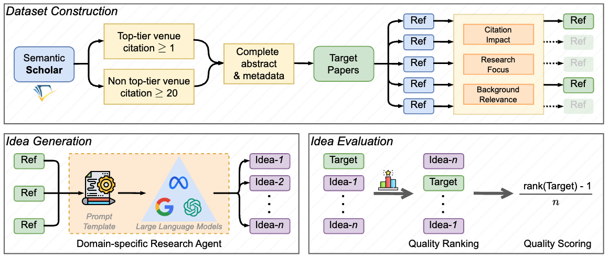

# IdeaBench


### 1. Setting up the Environment
1. **Create Conda Environment:**
	* Create a conda environment with required packages by running the following command in the terminal:
	* `conda env create -f environment.yml`
2. **Activate Conda Environment:**
	* `conda activate ideabench_env`

### 2. Configuration
1. Set up your `base_path`. 
	* In `src/build_dataset.sh`, `src/pipeline.sh`, `src/ablation_study.sh`, and `src/analyze_results.sh` set the `base_path` variable to be the path to the directory in where the repository is in. 
2. Set up your API keys. 
	* To be able to generate and evaluate research ideas using this repository, it its necessary to obtain at least an [OpenAI API key](https://platform.openai.com/docs/overview). If you wish to use the Gemini models or Llama 3.1 models to generate research ideas, you need to additionally have a [Google AI](https://ai.google.dev/gemini-api/docs/api-key) or a [DeepInfra](https://deepinfra.com/) API key respectively. Add the applicable API keys in the same bash scripts mentioned earlier.

### 3.  Building the Dataset (optional)
* Though we provide the dataset used in our benchmark in `/src/dataset`, you can optionally create a new dataset using `src/build_dataset.sh`. 
* To generate a new dataset, edit the `year` variable in `src/build_dataset.sh` to be the year you desire to extract target papers from, then execute the bash script in your terminal by running `./build_dataset.sh`. 

### 4. Generating and Evaluating Research Ideas
* To generate research ideas and evaluate them, you can use `pipeline.sh`.
* First set up how you want to generate research ideas by editing the following variables in `src/pipeline.sh`:

```# Input model you are interested in generating research ideas with here.

models=("gemini-1.5-pro" "gpt-4o-mini" "llama3.1-70b") # NOTE: To ensure the model name you provide is compatible, please refer to model_library.txt

all_ref="False" # When True, the LLM inputs all of a target paper's references. Whether they are filtered or not is determined by the filtered_ref variable.

num_hyp=3 # The number of research ideas you want to generate for a given query.

num_ref=3 # The maximum number of a target paper's references you want the LLM to input as background information when generating a research idea. NOTE: This is overrided when all_ref="True"

filtered_ref="True" # When True, you are using filtered references, otherwise, you using unfiltered references.
```
* Please refer to model_library.txt when choosing what model(s) you wish to generate research ideas with. 
* Also note that if you are using different file paths to the reference or target papers, you must edit the  `ref_file` variable and the `--target_papers` argument accordingly. 
* When you are done configuring `src/pipeline.sh`, execute the bash script in your terminal by running `./pipeline.sh`. 
### 5. Analyzing Results 
* You can get the semantic similarity, idea overlap, and Idea Scores from all the research ideas you generated at once using `src/analyze_results.sh`.
* First you must set up the variable `models=("<MODEL_NAME>:<PATH_TO_HIGH_RESOURCE_EVAL.csv>:<PATH_TO_LOW_RESOURCE_EVAL.csv>")`
* Populate this list with all the models you generated research ideas with along with the path their evaluation files are saved. An example of how this is done is provided in `src/analyze_results.sh`. By default, it is expected to have low and high resource results for each model, as done in the benchmark, however, if you have only outputs for one setting, just set both paths to be the same (note in this case, the txt files with the results will show repeated results for "low" and "high" resource scenarios). 
* Next set the `output_file` variable with the name you want the text file containing the results to be.
* Once configured, run `./analyze_results.sh`

### Note on API rate limits.
* Each API has their own respective rate limits.
* To avoid getting rate limit errors, it is recommended to avoid executing multiple `pipeline.sh` commands as once since multiple processes of generating and evaluating research ideas will be using your API concurrently.  If you do decide to do this, be careful that you do not surpass your rate limit, otherwise you will encounter issues. 
